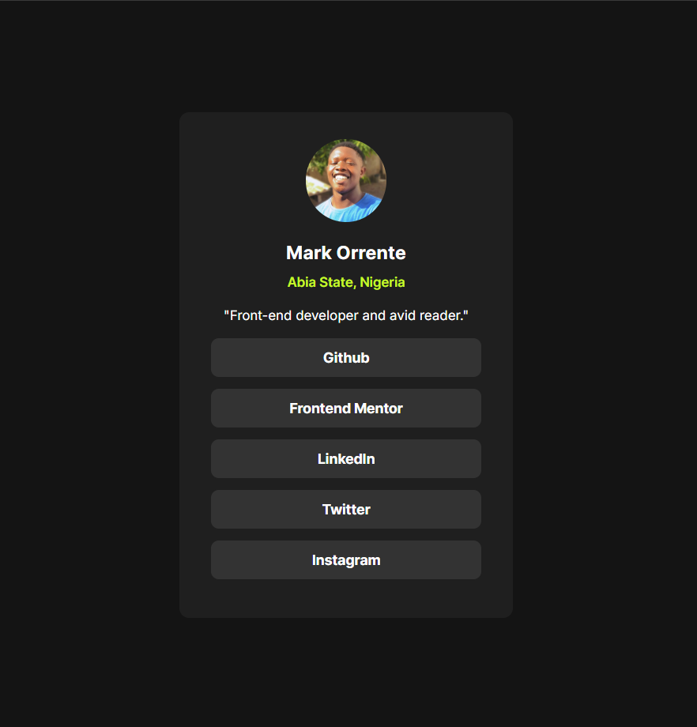

# Frontend Mentor - Social links profile solution

This is a solution to the [Social links profile challenge on Frontend Mentor](https://www.frontendmentor.io/challenges/social-links-profile-UG32l9m6dQ). Frontend Mentor challenges help you improve your coding skills by building realistic projects. 

## Table of contents

- [Overview](#overview)
  - [The challenge](#the-challenge)
  - [Screenshot](#screenshot)
  - [Link](#link)
- [My process](#my-process)
  - [Built with](#built-with)
  - [What I learned](#what-i-learned)
  - [Continued development](#continued-development)
- [Author](#author)

## Overview

### The challenge

Users should be able to:

- See hover and focus states for all interactive elements on the page

### Screenshot

## Link
[live site url](https://markorrente01.github.io/social-links/)

## My process

### Built with

* Semantic HTML5 markup
* SASS
* FlexBox

### What I learned

I think i have improved in the application of media queries with this challenge.

### Continued development
Looking forward to building more projects with HTML, SASS and Javascript or react js.

## Author
- Frontend Mentor - [@markorrente01](https://www.frontendmentor.io/profile/markorrente01)
